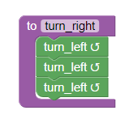
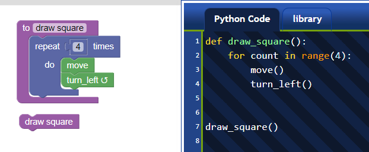

# Why `repeat`?

In Reeborg's World, I added a non-standard syntactic construction to Python with an additional keyword: `repeat`. [Note to self: this was done on Oct. 10, 2015.] This allows a student to write

```py
# draw square
repeat 4:
    move()
    turn_left()
```

instead of

```py
# draw square
for some_irrelevant_variable in range(4):
    move()
    turn_left()
```

Purists will no doubt object to this addition.  In this section, I explain my reasoning for this addition.

## Three types of loops

When writing programs, there are 3 basic cases for writing a loop:

1. repeating some instructions for each item of a "collection";
2. repeating some instructions while or until a certain condition is met;
3. repeating some instructions a fixed number of times.

Let's consider them in order.

### Items in a collection

Here are some examples from Python:

```py
# iterating over a list
for item in [1, 2, 3]:
    print(item)    # or do something else with the item ...

# iterating over a string:
for letter in "Python":
    print(letter)

# iterating over the keys of a dict
for key in {'a': 1, 'b': 2, 'c': 3}:
    print(key)

# iterating over a tuple
for item in (1, 2, 3):
    print(item)

# iterating over a set:
for element in {1, 2, 3}:
    print(element)

# iterating over a file; note that this is not the recommended way
for line in open('test.txt'):
    print(line)
```

The general pattern is

```py
for item in some_iterable:
    do_something(item)   # this can be an arbitrary code block
```

It is a powerful pattern which is definitely one of Python's strengths. It also needs to be understood before introducing the very useful list comprehensions and generator expressions in Python.

### While or until a condition is met

There are various ways to do this, using a `while` loop.  Here is just one example:

```py
while front_is_clear():
    move()
```

### Repeating a fixed number of times

We already have seen an example of repeating a fixed number of times before:

```py
# draw square
for some_irrelevant_variable in range(4):
    move()
    turn_left()
```

Python introduces a special built-in iterable, `range()`, which is then used in the generic for loop construct.  For experienced programmers, re-using such a powerful and relatively simple pattern for iterations is great.  However, I would argue that it is less than ideal for beginners.

## What's wrong with the for loop

Imagine the situation where students have learned two basic instructions: `move()` and `turn_left()`. You ask them to use these to draw a square:

```py
move()
turn_left()
move()
turn_left()
move()
turn_left()
move()
turn_left()
```

You rewrite this to draw their attention to the repeated pattern

```
move()
turn_left()

move()
turn_left()

move()
turn_left()

move()
turn_left()
```

And show them that, **using repeat** they can write this as:

```
repeat 4:
    move()
    turn_left()
```

You use this example to explain the concept of an **indented code block** the use of a colon, ":", to precede such a code block, and the introduction of one "special" keyword: `repeat`.

You can show how a pattern like this is "written" using Blockly:[1]


which gives another representation of what is meant by a **code block**. The next step might be to teach about defining functions:

```py
def turn_right():
    turn_left()
    turn_left()
    turn_left()
```

You can point out to them the repeating use of an indented code block preceded by a colon, and the use of a different keyword, `def`.  You might want to again show them a different representation of such a code block.



You can then combine the two concepts:

```py
def draw_square():
    repeat 4:
        move()
        turn_left()

draw_square()
```

which you can, if desired, also illustrate using Blockly



By contrast, if you decide to just use the standard for loop in Python:

```py
for some_variable in range(4):
    move()
    turn_left()
```

you will need to explain \(or at least mention\):

1. the concept of an indented code block preceded by a colon;
2. **two** new keywords, `for` and `in`;
3. the use of a **variable**, which is some quantity with a completely irrelevant name in this example, except that it cannot be a keyword.
4. the introduction of a built-in function, `range()`
5. that a function can have an **argument** and the notation for "passing" arguments to a function.

I believe that, until students have seen that functions can have arguments, such as `take("token")`, and have seen the concept of a variable, it is better to use `repeat` than the standard Python for loop idiom.[2]

I should also mention that I have often seen the following awful construct by Python beginners, some of whom were competent programmers in other languages:

```py
for i in range(len(some_list)):
    item = some_list[i]
    do_something(item)
```

instead of

```py
for item in some_list:
    do_something(item)
```

I believe that such awful constructs can be avoided if beginners are initially taught to use`repeat` and that the standard for loop idiom for repeating a fixed number of times is not taught until the students have seen some other examples of for loops. By that time, **if** they need the loop index, they would likely be ready to learn the proper Python idiom:

```py
for index, item in enumerate(iterable):
   do_something(index, item)
```

## Limitation of `repeat`

By design, what comes after `repeat` must evaluate as an integer without taking into account the surrounding lines of code.

Thus, the following two constructs are equivalent:

```py
repeat 6:
   move()

repeat 2*3:  # accidental artefact of the design
    move()
```

However, the following is **not** valid:

```py
n = 3
repeat n:  # n is not known on this line of code
    turn_left()
```

This is a design choice to force the transition to using "normal" Python as soon as students have learned about variables and need to use them to repeat a block of code a fixed number of times, as determined by the value of that variable.

[1]: I would argue that, even if you do not want your students to use Blockly, it might be useful occasionally and mostly at the beginning, to show them what a small "program" looks like using Blockly - if only to give them a different visual representation of the block-structure of code, like in the examples shown here.

[2]: When teaching older students in formal courses, like a university-level introduction to programming course, the use of `repeat` might be limited to only the first and possibly second week of teaching; by the end of the course, it should have been mostly forgotten by the students who would have become familiar with the standard Python idiom.

