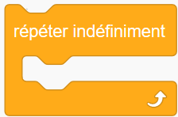
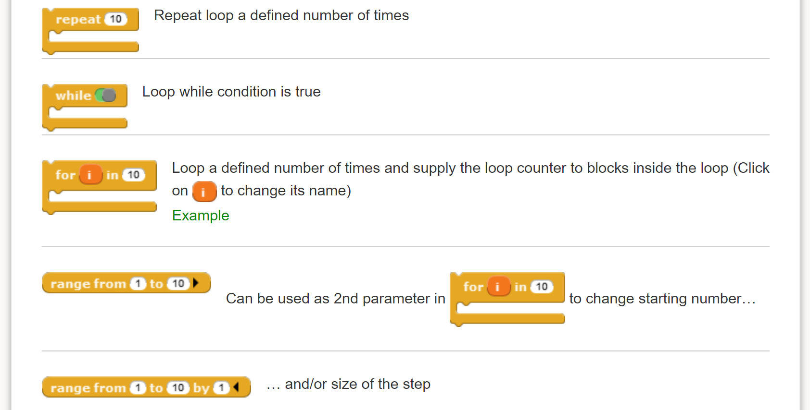

Special keyword: ``repeat``
============================

Repeating a series of instructions is something that is often done when
running programs.  Block-based programming environments, such as
`Scratch <https://scratch.mit.edu/>`_,
`Blockly <https://developers.google.com/blockly/>`_,
`GP <https://gpblocks.org/>`_, etc,
have different blocks that can be used for this purpose.  For example:

.. image:: images/repeat10.png
   :scale: 100 %
   :alt: Repeat 10 block

.. image:: images/repeat_until.png
   :scale: 100 %
   :alt: Repeat until block

and a "repeat forever" loop in French:

Depending on the block-based environment one uses, there are up to four
four main such cases, which can be written as follows
in standard Python::

    for _ in range(n):
        '''Repeat a series of instruction n times, without having to
           keep track of the specific iteration number
        '''

    while condition:
        '''Repeat a series of instruction an unspecified number of times,
           while a certain condition is met.
        '''

    while not condition:
        '''Repeat a series of instruction an unspecified number of times,
           until a certain condition is met.
        '''

    while True:
        '''Repeat a series of instruction an unspecified number of times,
           until a something inside the loop triggers a "break" to end the loop.
        '''

Inspired by the choices made by creators of block-based programming environments,
AvantPy introduces a few additional keywords to cover the 4 cases above
in a natural way::

    repeat n:
        # code

    repeat while condition:
        # code

    repeat until condition:
        # code

    repeat forever:
        # condition

A concrete example
-------------------

Suppose that I am teaching programming to beginners using Python's turtle module.
So far, we've only written programs that use one instruction per line::

    from turtle import forward, left

    # Draw a square

    forward(100)
    left(90)

    forward(100)
    left(90)

    forward(100)
    left(90)

    forward(100)
    left(90)

I wish to use this to show to students how we can have computers **repeat**
a given set of instructions, instead of typing them multiple times.
Using Python, here's the natural way to do this::

    from turtle import forward, left

    # Draw a square

    for variable in range(4):
        forward(100)
        left(90)

In doing so, I need to introduce all at once many new concepts and additional terms:

   1. the concept of an indented code block preceded by a colon;

   2. two keywords, ``for`` and ``in``;

   3. the use of a *variable*, which is some quantity with a completely irrelevant name in this example, except that it cannot be a keyword;

   4. the introduction of a built-in function, ``range()``, which, unlike ``forward()`` or ``left()``, does not have a visual representation.

By contrast, using the ``repeat`` keyword, the above can be written as::

    from turtle import forward, left

    # Draw a square

    repeat 4:
        forward(100)
        left(90)

and we only need to introduce fewer new topics:

   1. the concept of an indented code block preceded by a colon;

   2. one new keyword: ``repeat``.

More gradual approach
---------------------

As we are writing this, we note that
`GP control blocks <https://gpblocks.org/wiki/doku.php?id=blocks:control>`_
includes the following blocs which allow for a gradual
interpolation between something like ``repeat 10:`` and the
more complex and versatile Python idiom::

   for i in range(1, 10, step):
       # block

However, we do not see the need to include this type of granularity
in AvantPy.
