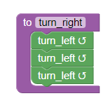
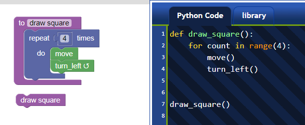

# AvantPy

_Python with training wheels: executable pseudocode in any language._

In this document, submitted in the [Request for Ideas](http://pyfound.blogspot.com/2019/01/python-in-education-request-for-ideas.html) phase, I use the name **AvantPy** as a placeholder for the entire concept described.

## Some observations

First, some observations, in no particular order.

- The mission of the Python Software Foundation is to promote, protect, and advance the Python programming language, and to support and **facilitate the growth of a diverse and international community** of Python programmers. [**Emphasis added.**]
- The success of block based programming environments, like [Scratch](https://scratch.mit.edu/), [Blockly](https://blockly-games.appspot.com/), and many others, demonstrates that it makes sense to introduce beginners to programming concepts in their native language.
- Python is often described as *executable pseudocode*. This is close to the truth if your pseudocode is written for an English audience who knows basic programming concepts but likely much less so for beginners who are not familiar with English.
- The creators of [Racket](https://racket-lang.org/) clearly believe that having various dialects of a given programming language can be useful in helping to learn programming, as they include various dialects as default language to be used in the learning journey.
- Amongst the *best practices* identified by the creators of Blockly is the need for an [exit strategy](https://developers.google.com/blockly/guides/app-integration/best-practices#9_exit_strategy):

    *Block-based programming is often a starting point for programming. In the context of teaching computer programming, it is a gateway drug that gets students addicted, before moving them on to harder things. How long this block-based programming period should last for students is hotly debated, but if your goal is to teach programming it should be temporary.*

    ...

    *Block-based programming environments used for teaching programming need to have a concrete plan for graduating their students. A solid exit strategy also goes a long way towards placating those who argue that block-based programming isn't "real programming".*
- In addition to Idle, there exists various editors or programming environment designed for beginners programmers using Python, either to be used locally as a desktop program, such as [Mu](https://codewith.mu/),
[Thonny](https://thonny.org/), [TigerJython](http://jython.tobiaskohn.ch/), etc.,
or as online environments, such as [Reeborg's World](http://reeborg.ca/reeborg.html).

Finally, I found the blog post [Can’t We All be Reasonable and Speak English?](https://stackoverflow.blog/2014/02/13/cant-we-all-be-reasonable-and-speak-english/) very instructive.

## What is AvantPy?

- AvantPy is a collection of dialects, each dialect being a superset of Python, designed to make it easier to learn programming concept in a given human language.
- AvantPy is a preprocessor, that takes a program written either totally or
in parts in a given dialect, and converts it to standard Python prior to execution.
  - A given program could include a mix of code written in normal Python and in a specific dialect.
- AvantPy also includes tools to analyze Python tracebacks and translate them into easier to understand feedback for users.
- AvantPy is written as a standard Python module/package meant to be usable with any "normal" Python environment.
- AvantPy also includes a tool to convert programs written in a given dialect into standard Python, showing the differences between the two, thus helping motivated users to make the transition to using standard Python.
- AvantPy is supported by a website that includes very basic explanations of
programming concepts for each dialect. These explanations can be linked to by tracebacks.

**AvantPy does not exist yet.** For now, it is a concept inspired by various experiments I have done, most of which are available on Github.

In addition, AvantPy **could** possibly include an REPL designed to make use of the above, something which I have also explored. However, I do not see this as important as the other aspects, and do not believe that it should be worked on until all of the other parts have been properly implemented.

## What is meant by training wheels?

The very first sentence of this document is _Python with training wheels: executable pseudocode in any language._ 
To help beginners learning how to ride a bicycle, one sometimes uses [training wheels](https://en.wikipedia.org/wiki/Training_wheels). After a while, the new cyclists ride
their bicycles without the training wheels needing to touch the ground to offer
additional support. This is what AvantPy aims to do for learning Python.

Say that I am a French speaker that learns to program using AvantPy.
My first program might be:

```py
imprime("Bonjour !")
```

A while later, I might write a program like the following:

```py
si x == 'q'
   imprime("Au revoir !")
```

When I would try to execute such a program, I might get the following error message:

```txt
Il y a une erreur de syntaxe dans ce programme dans la ligne contenant le code suivant:

    si x == 'q'

Une instruction débutant avec le mot "si" doit terminer par deux points (:).
[Voir documentation-si.]
```

The equivalent English version would be

```txt
There is a syntax error in this program at the line containing the following code:

    if x == 'q'

A statement beginning with the word "if" must end with a colon (:).
[Relevant link to the documentation on "if" provided here.]
```

Eventually, I might want to learn some "true" Python code.
I would make use of a tool provided to show me the true Python code corresponding
to the code written in my given dialect:

```py
if x == 'q':              # si x == 'q':
    print("Au revoir !")  #     imprime("Au revoir !")
```

AvantPy aims to leverage the whole Python ecosystem to help people learn programming.
Some people might never go beyond writing programs in their "local dialect".
Others might eventually learn to write programs in standard Python: this is
AvantPy's final aim, which is similar to Blockly's *exit strategy*, but is not an absolute requirement.

## How could it be implemented?

I created various toy programs [1](https://github.com/aroberge/nonstandard), [2](https://github.com/aroberge/experimental), [3](https://github.com/aroberge/pyextensions) to explore the ideas core to AvantPy, as I briefly described in [this blog post](https://aroberge.blogspot.com/2015/10/from-experimental-import-somethingnew.html) and in subsequent posts. **Note that the description in these
blog posts is different from the suggested implementation mentioned below.**
A more accurate description of the latest implementation I worked on can be [found here](https://aroberge.github.io/pyextensions/docs/html/modules.html); [see also](https://aroberge.github.io/pyextensions/docs/html/index.html).

The preprocessor needed to convert code written in a given dialect into standard
Python can be implemented using an import hook using the [importlib](https://docs.python.org/3/library/importlib.html) module.

The implementation of translated and easier to understand tracebacks can be done using [`sys.excepthook`](https://docs.python.org/3/library/sys.html#sys.excepthook).
I have done something similar before in two different contexts (and using two
different approaches): a [very basic version](https://github.com/aroberge/rur-ple/blob/master/rur_py/cpu.py#L296) when I created rur-ple in 2004, and 
a more involved one done [more recently in Reeborg's World](https://github.com/aroberge/reeborg/blob/master/src/js/runner/runner.js#L173) {This link should point to the Javascript method `RUR.runner.simplify_python_traceback`.}

To identify which dialect is used, two different methods could be used:

- a comment pragma, similar to what is done with Racket. For example, the
first line of a program written in the "French dialect" could be `#lang fr`
- a file extension different than the standard ".py". For example, a program
written in the "French dialect" could end with ".pyfr".

Based on the experiments I have done, both approaches could be used at the same
time, without causing any problems. My preferred approach would be to require
the use of a different file extension.

## Why go beyond a translation of keywords?

If one is going to write a preprocessor to translate Python's keywords, it
might make sense to also translate some Python *idioms* which might not be
as clear to beginners as other alternatives such as those found in 
Scratch or Blockly.  This is also keeping in line with Racket's philosophy
of using different dialect of its core language.

***

***

# More details

The following can be ignore if one wants to focus only on the basic idea.

As a concrete example, I begin by describing the motivation for adding a new keyword, `repeat`,
in an English dialect. I then explain how and why this should be extended to include other constructs, such as loops.

## Why `repeat`?

In Reeborg's World, I added a non-standard syntactic construction to Python with an additional keyword: `repeat`; this was also done by [Tobias Kohn](https://tobiaskohn.ch/), who created [TigerJython](http://jython.tobiaskohn.ch/) as part of his Ph.D. thesis.

A `repeat` keyword allows a student to write a program like the following:

```py
# draw square
repeat 4:
    move()
    turn_left()
```

instead of

```py
# draw square
for some_irrelevant_variable in range(4):
    move()
    turn_left()
```

Purists will no doubt object to this addition.  In this section, I explain my reasoning for this addition, first by describing loops as seen by experienced
Python programmers, followed by how they might be first encountered by beginners.

### Three types of loops

For an experience programmer, there are 3 basic cases for writing a loop:

1. repeating some instructions for each item of a "collection";
2. repeating some instructions while or until a certain condition is met;
3. repeating some instructions a fixed number of times.

Let's consider them in order.

### Items in a collection

Here are some examples from Python:

```py
# iterating over a list
for item in [1, 2, 3]:
    print(item)    # or do something else with the item ...

# iterating over a string:
for letter in "Python":
    print(letter)

# iterating over the keys of a dict
for key in {'a': 1, 'b': 2, 'c': 3}:
    print(key)

# iterating over a tuple
for item in (1, 2, 3):
    print(item)

# iterating over a set:
for element in {1, 2, 3}:
    print(element)

# iterating over a file; note that this is not the recommended way
for line in open('test.txt'):
    print(line)
```

The general pattern is

```py
for item in some_iterable:
    do_something(item)   # this can be an arbitrary code block
```

It is a powerful pattern which is definitely one of Python's strengths. It also needs to be understood before introducing the very useful list comprehensions and generator expressions in Python.

### While or until a condition is met

There are various ways to do this, using a `while` loop.  Here is just one example:

```py
while front_is_clear():
    move()
```

### Repeating a fixed number of times

We already have seen an example of repeating a fixed number of times before:

```py
# draw square
for some_irrelevant_variable in range(4):
    move()
    turn_left()
```

Python introduces a special built-in iterable, `range()`, which is then used in the generic for loop construct.  **For experienced programmers, re-using such a powerful and relatively simple pattern for iterations is great.**  However, I would argue that it is less than ideal for beginners.

#### What's wrong with the for loop

Imagine the situation where students have learned two basic instructions: `move()` and `turn_left()` in a programming environment,
such as [Reeborg's World](http://reeborg.ca/reeborg.html), or similar in
Python's turtle module. You ask them to use these to draw a square:

```py
move()
turn_left()
move()
turn_left()
move()
turn_left()
move()
turn_left()
```

You rewrite this to draw their attention to the repeated pattern

```py
move()
turn_left()

move()
turn_left()

move()
turn_left()

move()
turn_left()
```

And show them that, **using repeat** they can write this as:

```py
repeat 4:
    move()
    turn_left()
```

You use this example to explain the concept of an **indented code block** the use of a colon, ":", to precede such a code block, and the introduction of one "special" keyword: `repeat`.

You can show how a pattern like this is "written" using Blockly:


which gives another representation of what is meant by a **code block**. The next step might be to teach about defining functions:

```py
def turn_right():
    turn_left()
    turn_left()
    turn_left()
```

You can point out to them the repeating use of an indented code block preceded by a colon, and the use of a different keyword, `def`.  You might want to again show them a different representation of such a code block.



You can then combine the two concepts:

```py
def draw_square():
    repeat 4:
        move()
        turn_left()

draw_square()
```

which you can, if desired, also illustrate using Blockly



**By contrast**, if you decide to just use the standard for loop in Python:

```py
for some_variable in range(4):
    move()
    turn_left()
```

you will need to explain \(or at least mention\) five different **new** concepts:

1. the concept of an indented code block preceded by a colon, as for `repeat`;
2. **two** new keywords, `for` and `in` instead of a single one;
3. the use of a **variable**, which is some quantity with a completely irrelevant name in this example, except that it cannot be a keyword.
4. the introduction of a built-in function, `range()`
5. that a function can have an **argument** and the notation for "passing" arguments to a function.

I believe that, until students have seen that functions can have arguments, such as `take("token")` (example from Reeborg's World), and have seen the concept of a variable, it is better to use `repeat` than the standard Python for loop idiom.

## Other simpler loops

The `for var in range(n)` Python idiom is not the only one that could benefit from
a simpler syntax when teaching beginners.

Imagine that you want to teach the concepts of loops to beginners, and the syntax used for loops in the Python-like language you are using. These beginners have never seen the concept of loops before; if you have not taught such beginners, it is difficult to imagine how such a concept can be difficult to grasp when seen for the first time ... but it might be possible to imagine how a programming language syntax can complicate (or facilitate) the learning process. To this end, I will introduce the concept in a Python-like language **where keywords are based on the French language.**
The reason for choosing keywords written in French should become clear at the end.

A loop is a series of instructions that are repeated. The syntax used is the following:

```
répéter ? :
    # instructions
    # to be
    # repeated
    # are indented
```

For beginners, there are four types of loops, identified by a different expression replacing the question mark above.

```
répéter n:      # n is an integer
    # block

répéter sans_fin:
    # block

répéter jusqu_à condition:
    # block

répéter pendant_que condition:
    # block
```

**A quiz**: which of the above correspond to Python's
```py
while condition:
    # block
```

If you know French and what a Python `while` loop is, the answer is obvious.
If you know Python but don't know French, you likely have a 50% chance of being wrong.
If a Chinese version of the above had been given, the probability of error
would likely have increased to 75%.

## The English version of the four loops

The four versions above can be written (in a different order) as follows
in English:

```py
repeat n:
    # block

repeat while condition:
    # block

repeat forever:
    # block

repeat until condition:
    # block
```

**A quiz**: which of the above correspond to Python's

```py
while condition:
    # block
```
This is the same question as before, but this time the answer should be completely obvious to someone who knows English and knows what a Python `while` loop is.

### Python's version

As mentioned before, using boolean logic and the `not` keyword, we can write the
above loops as follows:

```py
for variable in range(n):
    # block

while True:
    # block

while not condition:
    # block

while condition:
    # block
```

For someone who is seeing the concept of loops for the very first time, the translation of any one of these four Python idioms (without seeing the other three) into the corresponding English version is likely not intuitively obvious.

### Executable pseudocode

Python is often described as executable pseudocode. Once people have learned a few idiomatic expressions, like `for variable in range(n)`, translating pseudocode written in English into Python is usually very straightforward.

If the pseudocode is not written in English, the translation process is, at least initially, not as straightforward as an additional mental step is required by the translation from the original language into Python's English. The small number of keyword in Python is a definite help in this process.

For absolute beginners who are learning programming concepts (control flow structures, defining functions, etc.), being able to use a language that uses keywords easily understood in their own language can definitely facilitate the learning process.
This is the approach taken by people using block-based environment
(Scratch, Blockly, etc.) to help students learn programming concepts.

## More about loops

In this section, I show the loops used in Blockly and Scratch.
In principle, and as mentioned previously, we have 4 different types of loops:

1. repeat n
2. repeat while condition
3. repeat until condition
4. repeat forever

I note that, for experienced programmers, the last two categories are usually
considered to be a single one, where one uses boolean logic (`not` in Python)
to transform a **while** type into an **until** type. However, this is not
the case for all beginners which has lead some designers of block-based programming
environments to distinguish between these two categories.

### Examples from Scratch

Scratch control blocks includes only 3 of the four categories:

1. repeat n


3. repeat until condition


4. repeat forever


Note that the word _repeat_ is absent for the infinite (forever) loop.
This is not the case for all languages; for example, the French version
does include the translation of _repeat_ for all 3 types of loops
including the infinite one.


To a Python programmer, it may come as a surprise that the `repeat until condition` is
included but not `repeat while condition`. Given the work that went into designing Scratch,
there is likely a fair bit of research that
lead to choosing this variant as the easiest and most natural
one to understand by beginners.
This might be because Scratch supports
programs with user interactions, such as mouse or key events,


and that, most often, one might want to keep on repeating **until** a
certain event takes place.


### Examples from Blockly

Blockly also includes only 3 of the four loop categories, but they are
not the same as Scratch.

1. repeat n


2. repeat while condition


3. repeat until condition


`repeat while condition` and `repeat until condition` are variants of a single block


Blockly does not include a `repeat forever` block.

#### From Blockly to Python

Blockly can translate block configurations into valid code for various
programming languages including Python.  Here, we show two examples
from [Reeborg's World](http://reeborg.ca/reeborg.html).


(The color scheme used for individual blocks is different in Reeborg's World
as compared with that used in Blockly; standard Blockly blocks for loops are
green whereas they are blue for Reeborg's World.)


As we can see, the required indentation of Python's syntax is a very
natural counterpart to Blockly's structure.

[Reeborg's World](http://reeborg.ca/reeborg.html) can also use the Javascript
version of the code generated by Blockly. While Javascript does not attach
any meaning to code indentation, Blockly nonetheless uses indentation to
help users connect the textual and the block representation of a given
code sample.


#### Further loops from Blockly

In addition to a variable-less version of `repeat n`, Blockly makes it
possible to define a block that is very similar to the more complex
version of Python's `for var in range(...)`.


It also includes a loop with a finite number of repetitions set by
the number of elements in a container


## Some acknowledgements

Many of the ideas discussed above have been suggested before. I know that I have
been influenced by posts on mailing lists and on blogs. Here I just wish to
acknowledge a few such discussions: **this is a very incomplete list**.

For example, the idea of being able to write Python keywords in various human languaged has been
discussed many times, including on the [Python ideas list in April 2009](https://mail.python.org/pipermail/python-ideas/2009-April/004179.html).

The idea of providing more helpful/verbose tracebacks has been [mentioned in 2012](https://mail.python.org/pipermail/python-ideas/2012-August/015987.html) on Python's
ideas list.  (Python `cgitb` module is an example, in a different context,
of a module designed to provide more detailed tracebacks; however, it would
definitely not be suitable for beginners.)

Also on the Python idea's list, I suggested providing a [translation for tracebacks in 2010](https://mail.python.org/pipermail/python-ideas/2010-May/007211.html)
with this more detailed [comment by Mariano Reingart](https://mail.python.org/pipermail/python-ideas/2010-May/007213.html).

The idea of providing hooks in **Idle** for various "dialects" was 
[mentioned by Terry Reddy](https://mail.python.org/pipermail/python-ideas/2015-October/036834.html).